### Escuela Colombiana de Ingeniería
### Arquitecturas de Software - ARSW
## Ejercicio Introducción al paralelismo - Hilos - Caso BlackListSearch

### Dependencias:
####   Lecturas:
*  [Threads in Java](http://beginnersbook.com/2013/03/java-threads/)  (Hasta 'Ending Threads')
*  [Threads vs Processes]( http://cs-fundamentals.com/tech-interview/java/differences-between-thread-and-process-in-java.php)

### Descripción
  Este ejercicio contiene una introducción a la programación con hilos en Java, además de la aplicación a un caso concreto.
  

**Parte I - Introducción a Hilos en Java**


1. De acuerdo con lo revisado en las lecturas, complete las clases CountThread, para que las mismas definan el ciclo de vida de un hilo que imprima por pantalla los números entre A y B.

> **Implementación ```CountThread```**
> ```java
> public class CountThread implements Runnable{
>    private int num1, num2;
>    public CountThread(int num1, int num2) {
>        this.num1 = num1;
>        this.num2 = num2;
>    }
>    @Override
>    public void run(){
>        for (int i=num1; i<=num2; i++){
>            System.out.println(i);
>        }
>    }   
> }
> ```

2. Complete el método __main__ de la clase CountMainThreads para que:
	1. Cree 3 hilos de tipo CountThread, asignándole al primero el intervalo [0..99], al segundo [99..199], y al tercero [200..299].
	2. Inicie los tres hilos con 'start()'.
	3. Ejecute y revise la salida por pantalla. 
	4. Cambie el incio con 'start()' por 'run()'. Cómo cambia la salida?, por qué?.

> **Implementación  ```CountMainThreads``` con ```start()```**
> ```java
> public class CountThreadsMain {
> public static void main(String a[]){
>        CountThread countThread1 = new CountThread(0,99);
>        CountThread countThread2 = new CountThread(99,199);
>        CountThread countThread3 = new CountThread(200,299);
>        Thread hilo1 = new Thread(countThread1);
>        Thread hilo2 = new Thread(countThread2);
>        Thread hilo3 = new Thread(countThread3);
>        hilo1.start();
>        hilo2.start();
>        hilo3.start();
>    }
>}
> ```

>**Resultado  ```CountMainThreads``` con ```start()```**
>
> 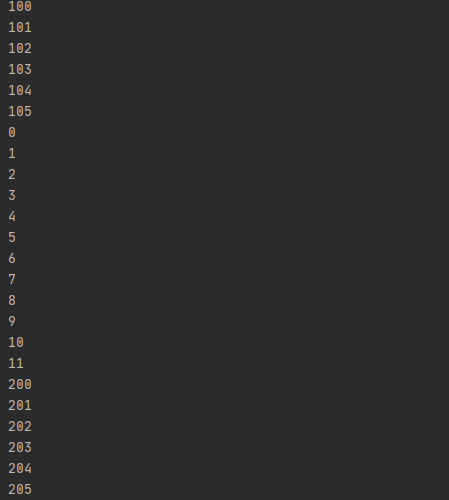

> **Implementación  ```CountMainThreads``` con ```run()```**
> ```java
> public class CountThreadsMain {
> public static void main(String a[]){
>        CountThread countThread1 = new CountThread(0,99);
>        CountThread countThread2 = new CountThread(99,199);
>        CountThread countThread3 = new CountThread(200,299);
>        Thread hilo1 = new Thread(countThread1);
>        Thread hilo2 = new Thread(countThread2);
>        Thread hilo3 = new Thread(countThread3);
>        hilo1.run();
>        hilo2.run();
>        hilo3.run();
>    }
>}
> ```

>**Resultado  ```CountMainThreads``` con ```start()```**
>
> 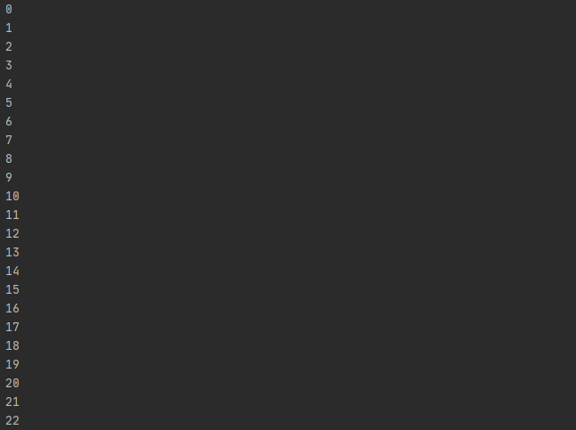
> 
> El cambio en la salida es que cuando se ejecuta con .start() nos va mostrando un intervalo de 10 números y los intercala entre los 3 hilos que están corriendo, mientras con .run() muestra todo el rango del hilo 1, luego del hilo 2 y por último del hilo 3.
>  
> Esto sucede debido a que al ejecutar con .start() los hilos se ejecutan de manera intercalada y con el .run() los ejecuta de uno en uno.
  
**Parte II - Ejercicio Black List Search**


Para un software de vigilancia automática de seguridad informática se está desarrollando un componente encargado de validar las direcciones IP en varios miles de listas negras (de host maliciosos) conocidas, y reportar aquellas que existan en al menos cinco de dichas listas. 

Dicho componente está diseñado de acuerdo con el siguiente diagrama, donde:

- HostBlackListsDataSourceFacade es una clase que ofrece una 'fachada' para realizar consultas en cualquiera de las N listas negras registradas (método 'isInBlacklistServer'), y que permite también hacer un reporte a una base de datos local de cuando una dirección IP se considera peligrosa. Esta clase NO ES MODIFICABLE, pero se sabe que es 'Thread-Safe'.

- HostBlackListsValidator es una clase que ofrece el método 'checkHost', el cual, a través de la clase 'HostBlackListDataSourceFacade', valida en cada una de las listas negras un host determinado. En dicho método está considerada la política de que al encontrarse un HOST en al menos cinco listas negras, el mismo será registrado como 'no confiable', o como 'confiable' en caso contrario. Adicionalmente, retornará la lista de los números de las 'listas negras' en donde se encontró registrado el HOST.


Al usarse el módulo, la evidencia de que se hizo el registro como 'confiable' o 'no confiable' se dá por lo mensajes de LOGs:

INFO: HOST 205.24.34.55 Reported as trustworthy

INFO: HOST 205.24.34.55 Reported as NOT trustworthy


Al programa de prueba provisto (Main), le toma sólo algunos segundos análizar y reportar la dirección provista (200.24.34.55), ya que la misma está registrada más de cinco veces en los primeros servidores, por lo que no requiere recorrerlos todos. Sin embargo, hacer la búsqueda en casos donde NO hay reportes, o donde los mismos están dispersos en las miles de listas negras, toma bastante tiempo.

Éste, como cualquier método de búsqueda, puede verse como un problema [vergonzosamente paralelo](https://en.wikipedia.org/wiki/Embarrassingly_parallel), ya que no existen dependencias entre una partición del problema y otra.

Para 'refactorizar' este código, y hacer que explote la capacidad multi-núcleo de la CPU del equipo, realice lo siguiente:

1. Cree una clase de tipo Thread que represente el ciclo de vida de un hilo que haga la búsqueda de un segmento del conjunto de servidores disponibles. Agregue a dicha clase un método que permita 'preguntarle' a las instancias del mismo (los hilos) cuantas ocurrencias de servidores maliciosos ha encontrado o encontró.

``` java
public class BlackListThread extends Thread{
    private static final int LIMIT_BLACK_LIST=5;
    private int Limit_INF;
    private int Limit_SUP;
    private String Incoming_Host;
    HostBlacklistsDataSourceFacade skds=HostBlacklistsDataSourceFacade.getInstance();
    ArrayList<Integer> blacklisted=new ArrayList<>();
    private int revisedBlackListsCount;
    private int blacklistedCount;

    public BlackListThread(int Limit_INF,int Limit_SUP,String Incoming_Host) {
        this.Limit_INF=Limit_INF;
        this.Limit_SUP=Limit_SUP;
        this.Incoming_Host=Incoming_Host;
        this.revisedBlackListsCount = 0;
        this.blacklistedCount = 0;
    }

    public void run() {
        for (int i=Limit_INF;i<Limit_SUP && blacklistedCount<LIMIT_BLACK_LIST;i++){
            revisedBlackListsCount++;
            if (skds.isInBlackListServer(i, Incoming_Host)) {
                blacklisted.add(i);
                blacklistedCount++;
            }
        }
    }

    public ArrayList<Integer> getBlacklisted() {
        return blacklisted;
    }

    
    public int getRevisedBlackListsCount() {
        return revisedBlackListsCount;
    }

    public int getBlacklistedCount() {
        return blacklistedCount;
    }
}

```

2. Agregue al método 'checkHost' un parámetro entero N, correspondiente al número de hilos entre los que se va a realizar la búsqueda (recuerde tener en cuenta si N es par o impar!). Modifique el código de este método para que divida el espacio de búsqueda entre las N partes indicadas, y paralelice la búsqueda a través de N hilos. Haga que dicha función espere hasta que los N hilos terminen de resolver su respectivo sub-problema, agregue las ocurrencias encontradas por cada hilo a la lista que retorna el método, y entonces calcule (sumando el total de ocurrencuas encontradas por cada hilo) si el número de ocurrencias es mayor o igual a _BLACK_LIST_ALARM_COUNT_. Si se da este caso, al final se DEBE reportar el host como confiable o no confiable, y mostrar el listado con los números de las listas negras respectivas. Para lograr este comportamiento de 'espera' revise el método [join](https://docs.oracle.com/javase/tutorial/essential/concurrency/join.html) del API de concurrencia de Java. Tenga también en cuenta:

	* Dentro del método checkHost Se debe mantener el LOG que informa, antes de retornar el resultado, el número de listas negras revisadas VS. el número de listas negras total (línea 60). Se debe garantizar que dicha información sea verídica bajo el nuevo esquema de procesamiento en paralelo planteado.

	* Se sabe que el HOST 202.24.34.55 está reportado en listas negras de una forma más dispersa, y que el host 212.24.24.55 NO está en ninguna lista negra.
```java
public List<Integer> checkHost(String ipaddress,int N) throws InterruptedException{
        ArrayList<Integer> blacklisted=new ArrayList<>();
        ArrayList<BlackListThread> threads = new ArrayList<BlackListThread>();
        int blacklistedCount=0;
        HostBlacklistsDataSourceFacade skds=HostBlacklistsDataSourceFacade.getInstance();
        int count = skds.getRegisteredServersCount()/N;
        int mod = skds.getRegisteredServersCount()%N;
        for (int i = 0;i<N;i++) {
            if(i == N-1) {
                BlackListThread h = new BlackListThread((i*count),(i*count) + count + mod ,ipaddress);
                threads.add(h);
                h.start();
            }else {
                BlackListThread h = new BlackListThread((i*count),(i*count)+count,ipaddress);
                threads.add(h);
                h.start();
            }
        }
        for (BlackListThread thread : threads) {
            thread.join();
        }
        int checkedListsCount=0;
        for (BlackListThread thread : threads) {
            checkedListsCount += thread.getRevisedBlackListsCount();
            blacklistedCount += thread.getBlacklistedCount();
            blacklisted.addAll(thread.getBlacklisted());
        }
        if (blacklistedCount>=BLACK_LIST_ALARM_COUNT){
            skds.reportAsNotTrustworthy(ipaddress);
        }
        else{
            skds.reportAsTrustworthy(ipaddress);
        }
        LOG.log(Level.INFO, "Checked Black Lists:{0} of {1}", new Object[]{checkedListsCount, skds.getRegisteredServersCount()});

        return blacklisted;
    }
```


**Parte II.I Para discutir la próxima clase (NO para implementar aún)**

La estrategia de paralelismo antes implementada es ineficiente en ciertos casos, pues la búsqueda se sigue realizando aún cuando los N hilos (en su conjunto) ya hayan encontrado el número mínimo de ocurrencias requeridas para reportar al servidor como malicioso. Cómo se podría modificar la implementación para minimizar el número de consultas en estos casos?, qué elemento nuevo traería esto al problema?

**Parte III - Evaluación de Desempeño**

A partir de lo anterior, implemente la siguiente secuencia de experimentos para realizar las validación de direcciones IP dispersas (por ejemplo 202.24.34.55), tomando los tiempos de ejecución de los mismos (asegúrese de hacerlos en la misma máquina):

1. Un solo hilo.
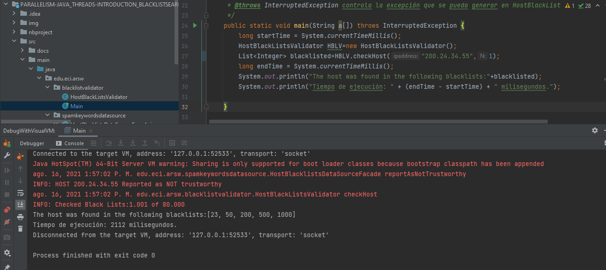
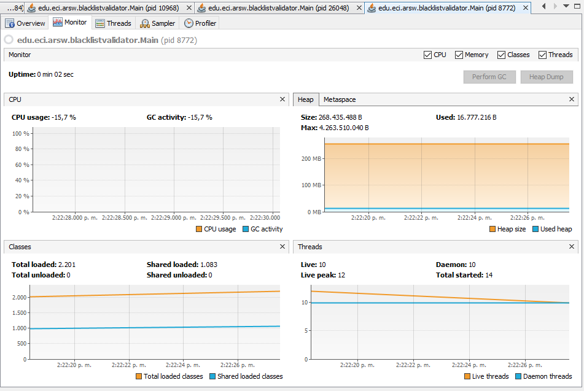
2. Tantos hilos como núcleos de procesamiento (haga que el programa determine esto haciendo uso del [API Runtime](https://docs.oracle.com/javase/7/docs/api/java/lang/Runtime.html)).
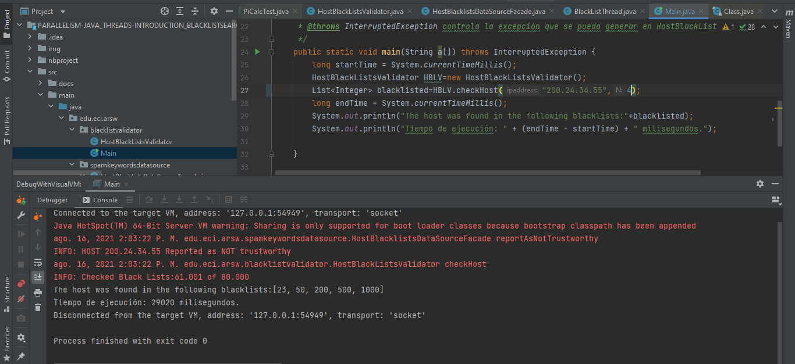
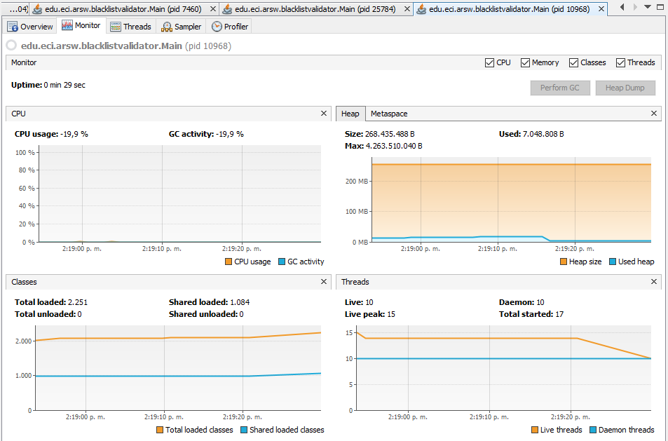
3. Tantos hilos como el doble de núcleos de procesamiento.
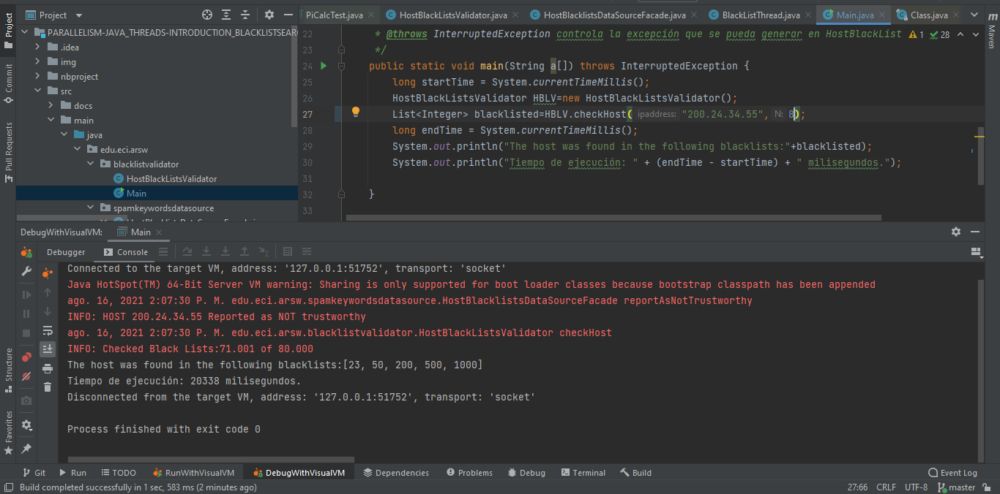
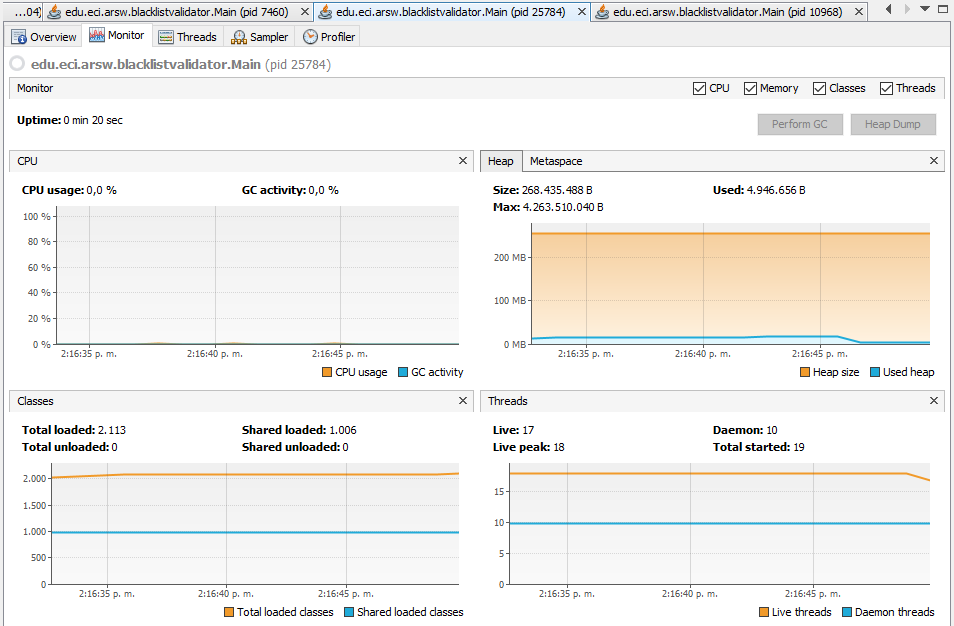
4. 50 hilos.
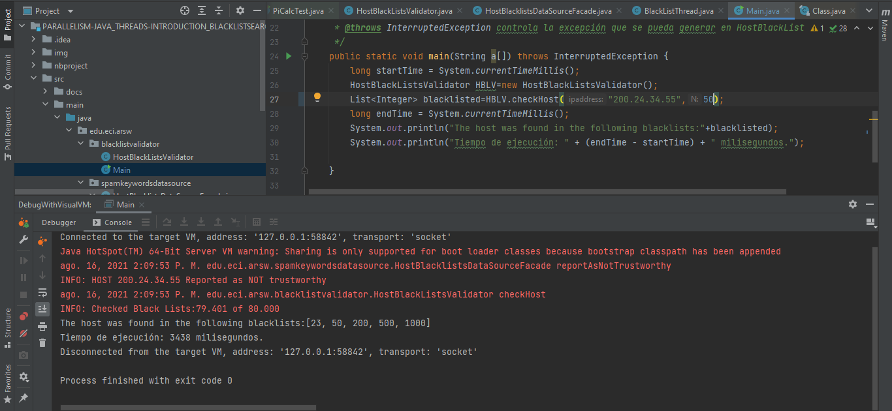
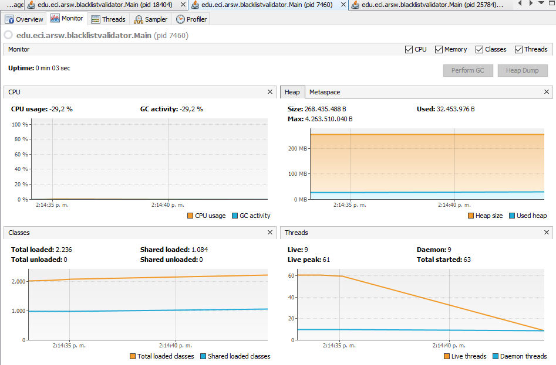
5. 100 hilos.
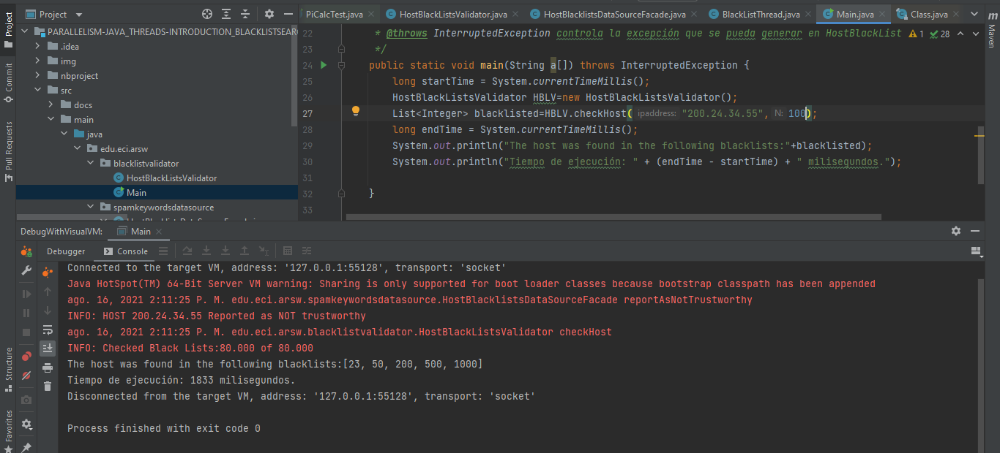
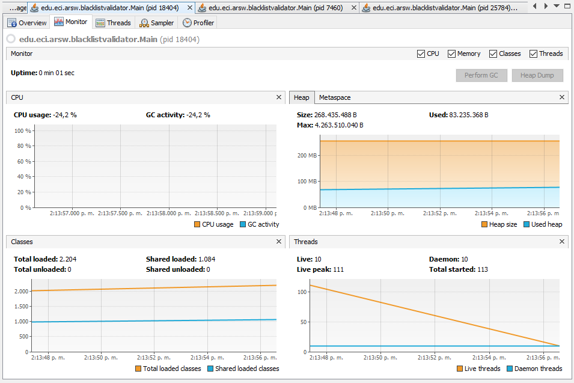


Con lo anterior, y con los tiempos de ejecución dados, haga una gráfica de tiempo de solución vs. número de hilos. Analice y plantee hipótesis con su compañero para las siguientes preguntas (puede tener en cuenta lo reportado por jVisualVM):

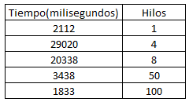
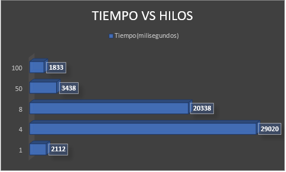

**Parte IV - Ejercicio Black List Search**

1. Según la [ley de Amdahls](https://www.pugetsystems.com/labs/articles/Estimating-CPU-Performance-using-Amdahls-Law-619/#WhatisAmdahlsLaw?):

	, donde _S(n)_ es el mejoramiento teórico del desempeño, _P_ la fracción paralelizable del algoritmo, y _n_ el número de hilos, a mayor _n_, mayor debería ser dicha mejora. Por qué el mejor desempeño no se logra con los 500 hilos?, cómo se compara este desempeño cuando se usan 200?. 

	* Al observar los resultados se puede concluir que en cuanto mayor es la cantidad de hilos menor es el tiempo de ejecución, sin embargo entre los casos de 200 y 500 hilos, no hay una gran diferencia debido a que el tiempo de ejecución se comienza a volver constante.
	
	
2. Cómo se comporta la solución usando tantos hilos de procesamiento como núcleos comparado con el resultado de usar el doble de éste?.

	* En este caso podemos observar que el resultado de usar el doble de cantidad de hilos como nucleos de procesamiento tiene un tiempo de ejecuación menor al usar tantos hilos como nucleos de procesamiento, sin embargo la reducción del tiempo de ejecución entre estos dos no es significativa.

3. De acuerdo con lo anterior, si para este problema en lugar de 100 hilos en una sola CPU se pudiera usar 1 hilo en cada una de 100 máquinas hipotéticas, la ley de Amdahls se aplicaría mejor?. Si en lugar de esto se usaran c hilos en 100/c máquinas distribuidas (siendo c es el número de núcleos de dichas máquinas), se mejoraría?. Explique su respuesta.
	
	* Dado que la ley de Amdahls nos asegura que en cuanto mayor es la cantidad de hilos hay una mejora en el tiempo de ejecución, podemos decir que el hecho de usar 100 máquinas para que cada una ejecute un hilo es un gasto innecesario de recursos y que además en ciertos casos podria aumentar el tiempo de ejecución de estos.

### Autores
* [Juan Camilo Molina leon](https://github.com/liontama2121)


### Licencia & Derechos de Autor
**©️** Juan Camilo Molina Leon, Estudiante de Ingeniería de Sistemas de la Escuela Colombiana de Ingeniería Julio Garavito

Licencia bajo la [GNU General Public License](/LICENSE.txt)
